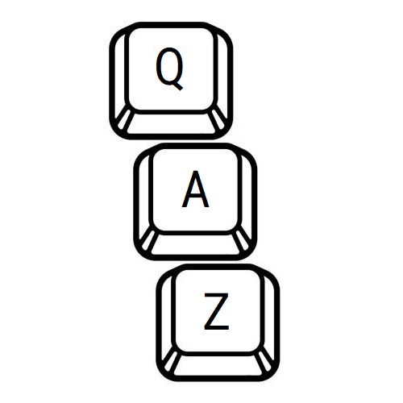
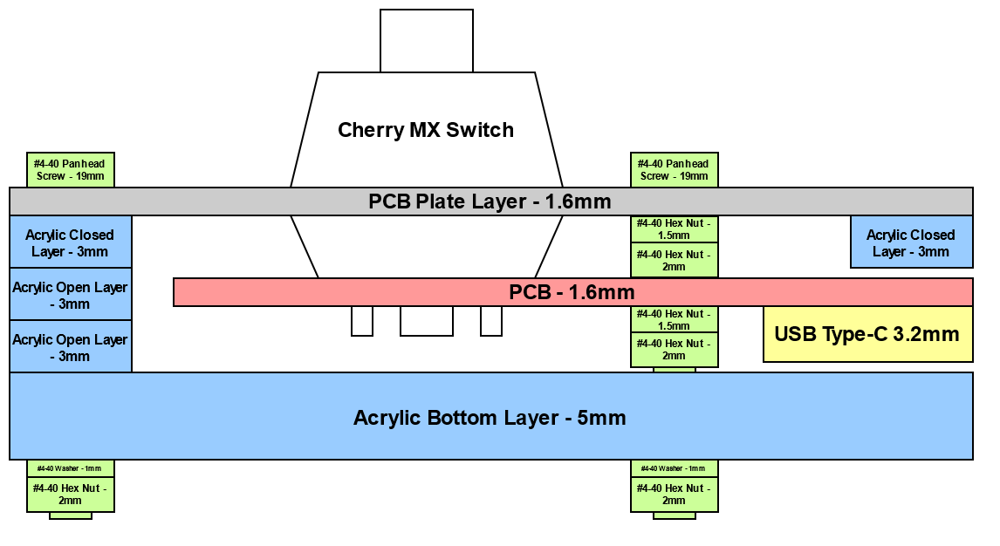
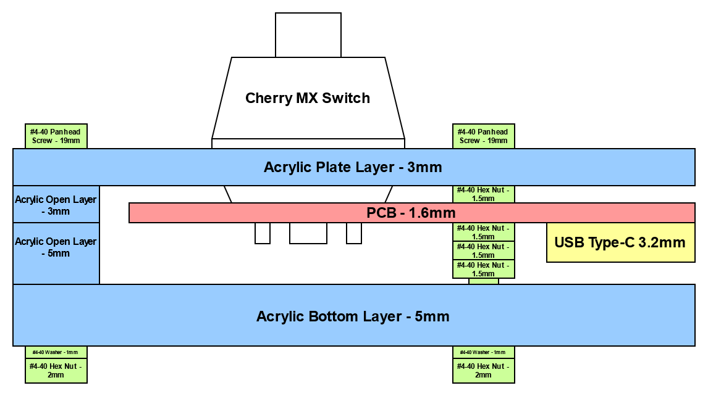

# QAZ

*STM32F042K6 Firmware for my 'QAZ' keyboard*

**`make doc` generates useful doxygen html documentation**



## Table of Contents

1. [About This Project](#about-this-project)
    1. [File Structure](#file-structure)
    1. [Dependencies](#dependencies)
1. [Building](#building)
    1. [Make](#make)
    1. [Useful Commands](#useful-commands)
1. [Software](#operation)
    1. [Clocks](#clocks)
    1. [Time Slice Loop](#time-slice-loop)
    1. [Keyboard](#keyboard)
1. [Hardware](#hardware)
    1. [PCB](#pcb)
    1. [Case](#case)

## About This Project

The QAZ project was created as a way for me to learn the USB protocol by
writing a bare-metal USB driver. Since a keyboard is a relatively simple
USB device, and I like mechanical keyboards, I decided that it would be
a perfect project. The QAZ project is planned to support various different
keyboard layouts (only 65% and a testboard for now).

This repository holds files for both the software and hardware portions
of this project. The software consists of C++ source and header files,
built using Make. Building is only supported in Debian-based systems.
CMSIS is used for some MCU hardware abstraction.

The PCB(s) for the different board versions have their schematic and
layouts designed in KiCad, which are contained in this library and can
be manufactured in any generic fabrication house.

There is a maker space at my work that has a laser cutter that can cut
acrylic, so decided to try to keep costs down and make a "sandwich" case,
which consists of several stacked layers of acrylic. The vector design
files are included in this repo.

### File Structure

```
└── QAZ/
    ├── build/
    │   └── CMake build directory
    │
    ├── docs/
    │   ├── doxygen/
    │   │   └── documentation generated by Doxygen
    │   │
    │   └── media/
    │       └── diagrams, pictures, etc.
    │
    ├── hardware/
    │   ├── common/
    │   │   └── hardware utility used by both (e.g. KiCad libraries)
    │   │
    │   └── QAZ_*/
    │       └── PCB/case layer subdirectories for each QAZ configuration
    │
    ├── scripts/
    │   └── useful project scripts (cpplint.py, Doxyfile, etc.)
    │
    ├── src/
    │   └── all source files/module subdirectories, source-level CMakeLists.txt
    │
    └── LICENSE, README, top-level Makefile/CMakeLists.txt
```

The `docs\doxygen` and `build` directories are not tracked, and get made when the
project is built. The files in these directories are removed when the project
is cleaned with `make clean`.

### Dependencies

Required APT packages for building:
- gcc-arm-none-eabi
- build-essential
- cmake (>= 3.16.3)

Required APT packages for utility targets and debugging:
- gdb-multiarch
- openocd
- stlink-tools
- doxygen
- graphviz
- python

Additionally, KiCad is used for PCB design.

## Building

### Make

QAZ uses `make` for top-level project building. This [Makefile](Makefile)
handles all building commands. These are the available commands:

- `QAZ` - Build complete software target

- `all` - Build software target, doxygen, and lint

- `docs` - Use Doxygen to create project documentaton (with Graphviz graphs)

- `clean` - Removes all built files

- `lint` - Run cpplint.py on `src/`

- `flash` - Flash binary at 0x08000000, `make QAZ` if no binary

- `help` - Display the above

There are several variables that the user can set in the top level `Makefile`.

- `BUILD_TYPE` - Debug or Release (i.e. debug print statements/asserts or not)

- `BOARD` - Which board to build for (dictates BSP)

### CMake

When building the output project, `cmake` will be invoked to generate the
source-level [Makefile](Makefile) in the `build/` directory, which will
then be used to compile and link the output excecutable.

The top-level [CMakeLists.txt](CMakeLists.txt) expects three variables:
`TARGET`, `CMAKE_BUILD_TYPE`, and `BSP`, which is nominally passed in by
the top-level [Makefile](Makefile) from the `TARGET`, `BUILD_TYPE`, and `BOARD`
variables (respectively). This file also defines our compilers/linkers, as well
as all of the flags we pass to them. `src/` is added as a subdirectory.

The source-level [CMakeLists](src/CMakeLists.txt) expects the same variables
as above. This file defines all C++, C, and Assembly files (paths relative to
`src/`), as well as include directories.

### Output

After building, output targets can be found in `build/src`. The default output
target is `QAZ.elf`. This is copied and converted to `QAZ.bin`. To help
tracking .elf/.bin files, both are then copied and renamed to:
`${BOARD}_${BUILD_TYPE}_${GIT_STATE}_${GIT_HASH}.*` (`GIT_STATE` is either
`CLEAN` or `DIRTY`).

## Software

### Clocks

The STM32F042C6T6 has a default HS clock of 8MHz, and a HSI48 48MHz clock,
which is specifically for the USB peripheral. This clock has a terrible
accuracy of +/-3% at room temperature, which is out of spec of USB 2.0
tolerance. However, the USB peripheral has a special Clock Recovery System
(CRS) which dynamically adjusts the oscillator an adequate amount.

In the intial steps of this design, this HSI48 was used, but as of QAZ board
v0.1 an external 8MHz crystal supplies the HSE oscillator, which gets
multiplied to 48MHz from the PLL, then finaly feeds the system core and USB
peripheral.

### Time Slice Loop

The QAZ firmware does not operate on an RTOS, because it doesn't require
stringent timing, but rather a time slice superloop. The configuration of
this is defined in [core/time_slice.hpp](src/core/time_slice.hpp).

Tasks must be registered to the timeslice scheduler by calling
`timeslice::register_task()`, with the task period and function as parameters.
Registered tasks are entered in a statically defined task registry, so the
maximum number of tasks is defined by `MAX_NUM_TASKS`.

While the timeslice loop is running, the interal 'time slice mananger task'
will make sure that each task gets a chance to run every loop period. Specific
task periods are created by only calling the task function every N time slices
(where N = Task Period / Loop Period).

**Task periods must be multiples of of the timeslice period. For a given set
of task periods, the timeslice period should be as large as possible.**

Curently, the time slice loop (`LOOP_PERIOD_MS`) is 10ms.

Task periods:
- **LED Heartbeat Task** - 500ms
- **Key Matrix Scan Task** - 20ms
- **RGB LED Task** - 20ms
- **USB HID KB Task** - 20ms

### Keyboard

The keyboard layout for a QAZ configuration is defined in the BSP file for the
board. `COLS` and `ROWS` define the physical pins of the key matrix. The
`BASE_TABLE` and `FN_TABLE` defines the keyboard layout for a given row and
column pin, with column0/row0 being the "top left" of the keyboard.

The entries in the key layout table correspond to a given entry in the USB HID
usages table, as well as "extra" codes added that correspond not to actual
codes, but actions to perform. For instance, changing the keyboard RGB LED
brightness and color. `NONE` is used when no keycode or action corresponds to
with the key on the layer.

There is a special key called `FN`, which when pressed switches the key
layout layer from Base to Fn. This means the any other key also pressed with
the `FN` key will result in the `FN_TABLE` being used to translate key presses
into key codes/actions rather than `BASE_TABLE`. This allows almost double the
amount of "keys" on the keyboard.

For example, in the QAZ 65%, pressing just the "1/!" physical key results in
the Base keycode (0x1E) for that key being sent to the host. If instead the
"1/!" physical key AND the "FN" physical key were pressed, then the Fn keycode
(0x3A, the F1 keycode) for that given key is sent instead.

It important to keep in mind, that since keyboard layouts are not exact grids,
not every column/row pin corresponds to a physical pin, but must be defined in
each table grid (and given a `NONE` value).

Additionally, any of the keys can also be defined in `CALLBACK_KEY_TABLE`,
which (when a key with that code is pressed) results in the key NOT being
placed in the output key buffer (used by the USB KB HID task to send keycodes
to the host), but having a callback (initally defined as `weak`) called. This
allows other modules defining the callback and implementing a hook to execute
when the given key is pressed (seen in RGB LED module).

### Persistent Data

There are several data words that are saved in the interal flash, as it is
desired that they persist between PORs (for instance, the lighting settings).
This is achieved by emulating the flash as EEPROM.

This emulation requires two full flash pages be used. In order to maximize the
available flash for the program, the last two pages are used. Since each page
is 1kB, this means that the availble flash in the STM32F042K6 for the program
is 30kB, with the last 2kB being reserved.

New data words can be added by adding entries to the `PERSIST_DATA_TABLE` in
[src/qaz/persist.hpp](src/qaz/persist.hpp), and increasing `NB_OF_VAR` in
[src/flash/eeprom.h](src/flash/eeprom.h).

## Hardware

All QAZ hardware configurations are comprised of a 2-layer PCB inside of a
acrylic layer "sandwich" case.

### PCB

Each configuration Kicad project is located in `hardware/QAZ_*/pcb/`. Each
schematic and layout has been developed using Kicad tools. The nominal
fabrication flow is to generate the board layer Gerber files (and
plated/non-plated drill hole files), and send them off to a fabrication house.

Also included in each Kicad project directory is a BOM.

The QAZ symbol and footprint libraries can be found in `hardware/common/pcb/`.
These hold the things that are used in multiple QAZ PCBs.

The USB-C connector symbol/footprint is from
[here](https://github.com/ai03-2725/Type-C.pretty).

### Case

Each case is comprised of several  layers. The vector files for these layers are 
located in `hardware/QAZ_*/layers/`.

There are four types of layers:

- **Bottom Layer** - Mostly solid bottom layer, with only drill holes for mounting
  screws and the boot switch. 5mm acrylic.
- **Closed Layer** - Board outline (middle) layer, with outside drill holes. 
  3mm or 5mm acrylic.
- **Open Layer** - Board outline (middle) layer, with outside drill holes and
  opening for USB-C port. 3mm or 5mm acrylic.
- **Plate Layer** - Top layer with cutouts for all of the key switches,
  stabilizers, and drill holes. 3mm acrylic or 1.6mm PCB.

The plater layer on keyboards is traditionally make out of ~1.5mm thick metal,
which allows the keycaps to actually "snap" into the plate, and sit flush with
the PCB. Since I don't currently have functionality to cut metal, there are two 
options:

1. Fabricate a ~1.6mm PCB (<$50 for 5 from JLCPCB!). This is preferred as the
  switches actually snap into the plate. Side-cut view of the case:



2. Fabricate a ~3mm layer of acrylic. Side-cut view of the case:



The mounting screws/nuts used are of size #4-40. The quantities of screws and
nuts for the QAZ 65% are:

- 20x 3/4in. #4-40 panhead machine screw
- 60x #4-40 hex nuts (1.5mm and 2mm width)
- 20x #4-40 washers
