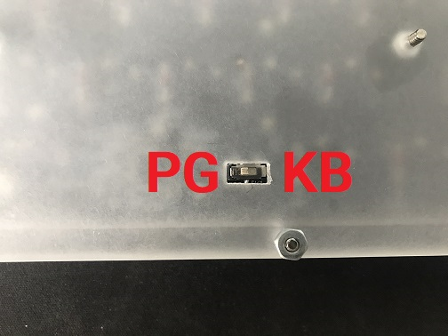
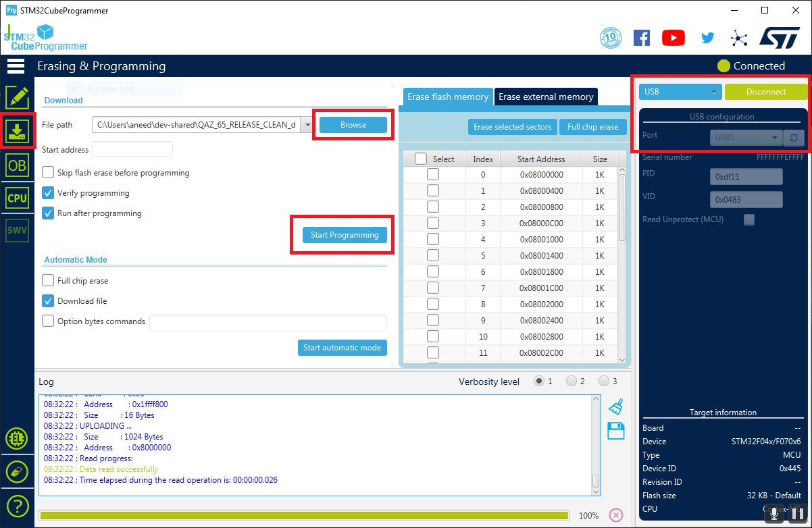

# **QAZ Programming**

## **Table of Contents**

1. [Required Software](#required-software)
1. [Programming](#programming)

## **Required Software**

[STM32CubeProgrammer](https://www.st.com/en/development-tools/stm32cubeprog.html) is used to
connect to the STM32 bootloader, to program a board via USB DFU (nominally) or SWD (JTAG).

## **Programming**

The following steps should be followed to program a given QAZ board.

1. Unplug the board and flip the boot switch, accessible on the back of the board, to the "PG" 
side.

1. Plug the board back in, and open STM32CubeProgrammer.
1. Select "USB" as method of programming. "Port" should be "USB1", as the bootloader device should
be automatically detected. If not, hit the refresh button to the right. When the PID/VID are
filled, hit the "Connect" button, which should result in "Data read successfully" in the log. Open
the "Erasing & Programming" window by clicking on the second icon on the left. Open "Browse", and
select the desired .elf program file. Finally, click "Start Programming". 

1. Unplug the board, flip the boot switch to the "KB" side, and plug the board back in. The board
should now be programmed.