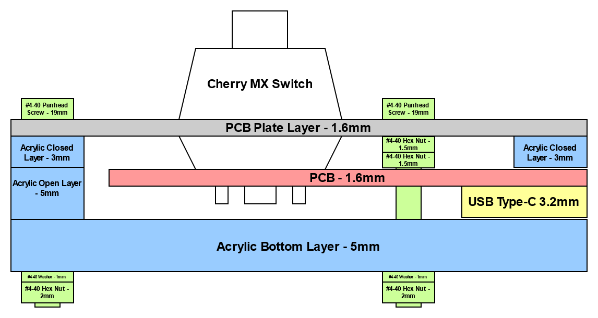

# **QAZ 65% Keyboard**


## **Table of Contents**

1. [About This Board](#about-this-board)
1. [Software](#software)
1. [Hardware](#hardware)
    1. [PCB](#pcb)
    1. [Case](#case)
1. [Previous Versions](#previous-versions)
    1. [v1.0](#v1.0)

## **About This Board**

The QAZ 65% is a 68-key keyboard in a non-standard configuration. It features RGB back lighting,
with configurable lighting.


### **KLE Layout**

```
["Esc","!\n1","@\n2","#\n3","$\n4","%\n5","^\n6","&\n7","*\n8","(\n9",")\n0","_\n-","+\n=",{w:2},"Backspace","~\n`"],
[{w:1.5},"Tab","Q","W","E","R","T","Y","U","I","O","P","{\n[","}\n]",{w:1.5},"|\n\\","Del"],
[{w:1.75},"Caps Lock","A","S","D","F","G","H","J","K","L",":\n;","\"\n'",{w:2.25},"Enter","PgUp"],
[{w:2.25},"Shift","Z","X","C","V","B","N","M","<\n,",">\n.","?\n/",{w:1.75},"Shift","↑","PgDn"],
[{w:1.25},"Ctrl",{w:1.25},"Opt",{w:1.25},"Alt",{a:7,w:6.25},"",{a:4},"Alt","Ctrl","Fn","←","↓","→"]
```

## **Software**

The software target for this board can be selected by setting `BOARD` to `QAZ_65`.

This will switch in software modules specific to the QAZ 65% board, such as the keyboard matrix,
RGB LED lighting, USB Keyboard HID driver, etc.

## **Hardware**

The QAZ 65% keyboard hardware is comprised of a 2-layer PCB inside of an acrylic layer "sandwich"
case.

The latest version of the QAZ 65% hardware is tagged as
[`hw/qaz_65_v1.1`](https://github.com/anthonyneedles/QAZ/releases/tag/hw%2Fqaz_65_v1.1).

### **PCB**


The KiCad project for the board PCB is located in
[`hardware/QAZ_65/pcb/QAZ_65/`](../../hardware/QAZ_65/pcb/QAZ_65/).

The Bill of Materials for the electronic components can be found at
[`hardware/QAZ_65/pcb/QAZ_65/QAZ_65_1v1_BOM.xlsx`](../../hardware/QAZ_65/pcb/QAZ_65/QAZ_65_1v1_BOM.xlsx).

### **Case**

The vector files for the case layers are located in
[`hardware/QAZ_65/layers/`](../../hardware/QAZ_65/pcb/QAZ_65/).

There are four layers (from bottom to top):

- **Bottom Layer** - Mostly solid bottom layer, with only drill holes for mounting screws and the
boot switch. 5mm acrylic, frosted clear.
- **Closed Layer** - Board outline (middle) layer, with outside drill holes. 5mm acrylic, frosted
clear.
- **Open Layer** - Board outline (middle) layer, with outside drill holes and opening for USB-C
port. 3mm acrylic, frosted clear.
- **Plate Layer** - Top layer with cutouts for all of the key switches, stabilizers, and drill
holes. 1.6mm PCB, matte black.

The mounting screws/nuts used are of size #4-40.

Rubber feet are added to the bottom of the board to prevent mounting screws from scratching the
surface below.

### **Side Cut Diagram**



## **Previous Versions**

### **v1.0**

The v1.0 version of the QAZ 65% hardware is tagged as
[`hw/qaz_65_v1.0`](https://github.com/anthonyneedles/QAZ/releases/tag/hw%2Fqaz_65_v1.0).

This release was proceeded by v1.1, which changed the LED driver, to allow for the driving of many
more RGB LEDs, to "spread" out the backlight. Also, the SWD port was removed, but the signals to
the MCU can still be accessed by several test points located on the board.