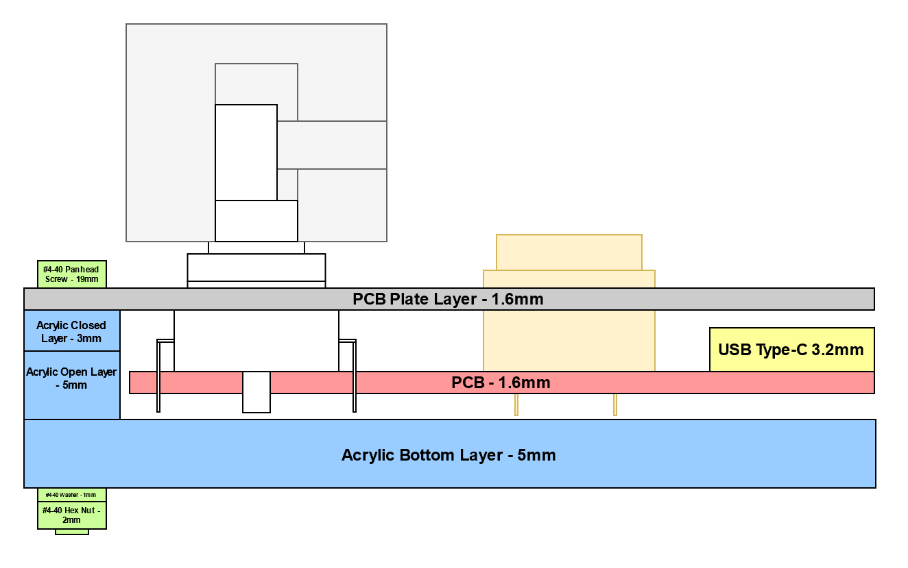

# **QAZ Media**

## **Table of Contents**

1. [About This Board](#about-this-board)
1. [Software](#software)
1. [Hardware](#hardware)
    1. [PCB](#pcb)
    1. [Case](#case)

## **About This Board**

The QAZ Media board is an ancillary device for controlling media. It features buttons for
pausing/skipping/etc., as well as a volume knob.

## **Software**

The software target for this board can be selected by setting `BOARD` to `QAZ_MEDIA`.

This will switch in software modules specific to the QAZ Media board, such rotary encoding, USB
Consumer HID driver, etc.

## **Hardware**

The QAZ Media keyboard hardware is comprised of a 2-layer PCB inside of an acrylic layer "sandwich"
case.

The latest version of the QAZ Media hardware is tagged as
[`hw/qaz_media_v1.0`](https://github.com/anthonyneedles/QAZ/releases/tag/hw%2Fqaz_media_v1.0).

### **PCB**

The KiCad project for the board PCB is located in
[`hardware/QAZ_media/pcb/QAZ_media/`](../../hardware/QAZ_media/pcb/QAZ_media/).

The Bill of Materials for the electronic components can be found at
[`hardware/QAZ_media/pcb/QAZ_media/QAZ_media_1v0_BOM.xlsx`](../../hardware/QAZ_media/pcb/QAZ_media/QAZ_media_1v0_BOM.xlsx).

### **Case**

The vector files for the case layers are located in
[`hardware/QAZ_media/layers/`](../../hardware/QAZ_media/pcb/QAZ_media/).

There are four layers (from bottom to top):

- **Bottom Layer** - Mostly solid bottom layer, with only drill holes for mounting screws and the
boot switch. 5mm acrylic, frosted clear.
- **Closed Layer** - Board outline (middle) layer, with outside drill holes. 5mm acrylic, frosted
clear.
- **Open Layer** - Board outline (middle) layer, with outside drill holes and opening for USB-C
port. 3mm acrylic, frosted clear.
- **Plate Layer** - Top layer with cutouts for all of the key switches, stabilizers, and drill
holes. 1.6mm PCB, matte black.

The mounting screws/nuts used are of size #4-40.

Rubber feet are added to the bottom of the board to prevent mounting screws from scratching the
surface below.

### **Side Cut Diagram**

